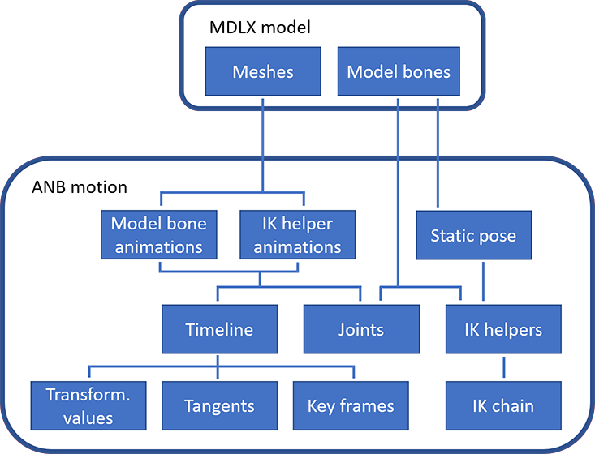
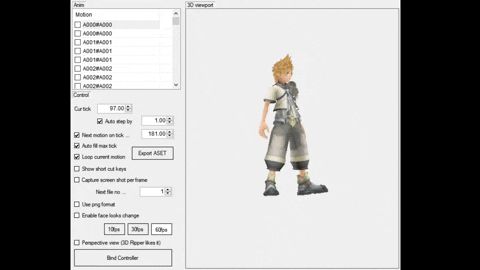

# [Kingdom Hearts II](../../index.md) - Interpolated motion

This documentation is based on the hard work of [Kenjiuno's MSET docs](https://gitlab.com/kenjiuno/msetDoc).

Interpolated motions are a sub-category of a [motion file](anb.md#motion-data), found inside ANB files.

The purpose of this file is to animate a 3D model. The motion file will use certain structured to set an initial pose for the character and then animate the single bones by specifying how a specific transformation is performed between two points in time. Internally, there is a timeline with one or multiple keyframes, where every keyframe is associated to a specific bone and to a specific [channel](#channels).

Since the animation is interpolated, the game engine can seamlessly change the running animation to another animation by interpolating the movement, creating fluidity. Also it is possible to scale the animation at `n` FPS. Those two advantages are not present in [RAW animations](anb.md#motion-data).

Also, a motion file can define additional bones, in addition to the bones from the model: those are used by the Inverse Kinematic. For the animation `P_EX100\A000` (battle idle), those IK bones are parents of the feet's bones. That is used to both animate the legs movement in a realistic way and to move the leg up when it performs a collision to the stairs, for instance.

This format is still in research as there are some tables where the purpose is still unknown. With `OpenKh.Kh2.Motion`, it is currently possible to parse and create motion files.

## Motion data

This is a continuation of the [motion header](anb.md#motion-header). The very top header is exactly the same as the RAW motions, but the rest of the structure is compeltely different.

### Interpolated motion header

Located straight after the motion header, it defines where all the structures are phyisically located inside the files. All the offsets uses `0x90` as origin. Some of the tables have no `count`, but only their `offset`. It is speculated that the game engine do not need to know their amount because there is no need to loop through them: other tables will reference them through an index.

As this documentation is complementary to the one from [Kenjiuno](https://gitlab.com/kenjiuno/msetDoc), their original naming will be mentioned too (eg. `T2`, `T2X`, etc.).

| Offset | Type | Description
|--------|------|--------------
| 0x00   | short| Bone count. Must match with the bone count of the model
| 0x02   | short| Total bone count. This is basically Bone Count + IK Bone Count
| 0x04   | int  | Total frame count. How many frames the animation contains
| 0x08   | int  | [IK helpers](#inverse-kinematic-helper) offset
| 0x0C   | int  | [Joint indices](#joint-definition) offset
| 0x10   | int  | [Key frames](#key-frames) count
| 0x14   | int  | [Static pose](#static-pose) offset
| 0x18   | int  | [Static pose](#static-pose) count
| 0x1C   | int  | [Footer](#footer) offset
| 0x20   | int  | [Model bones animations](#model-bones-animation) offset
| 0x24   | int  | [Model bones animations](#model-bones-animation) count
| 0x28   | int  | [IK helper animations](#inverse-kinematic-helper-animation) offset
| 0x2C   | int  | [IK helper animations](#inverse-kinematic-helper-animation) count
| 0x30   | int  | [Timeline](#timeline) offset
| 0x34   | int  | [Key frames](#key-frames) offset
| 0x38   | int  | [Transformation values](#transformation-values) offset
| 0x3C   | int  | [Tangents](#tangents) offset
| 0x40   | int  | [IK chains](#inverse-kinematic-chain) offset
| 0x44   | int  | [IK chains](#inverse-kinematic-chain) count
| 0x48   | int  | Unknown
| 0x4C   | int  | [Table 8](#table-8) offset
| 0x50   | int  | [Table 7](#table-7) offset
| 0x54   | int  | [Table 7](#table-7) count
| 0x58   | int  | [Table 6](#table-6) offset
| 0x5C   | int  | [Table 6](#table-6) count
| 0x60   | vec4f | Bounding Box minimum
| 0x70   | vec4f | Bounding Box maximum
| 0x80   | float | Frame loop
| 0x84   | float | Frame end
| 0x88   | float | Frames per second, defines the LFR
| 0x8c   | float | Frame count, expressed in LFR
| 0x90   | int  | [Unknown table](#unknown-table) offset
| 0x94   | int  | [Unknown table](#unknown-table) count
| 0x98   | int  | Unknown
| 0x9C   | int  | Unknown

### Inverse Kinematic helper

Formerly known as `T5`. Creates additional "joints", in a very similar way the bones or a skeleton are structured. Please see [IK chain](#inverse-kinematic-chain) to know more. Its strucutre is exactly the same as the one found on [MDLX's models](../model.md).

| Offset | Type | Description
|--------|------|--------------
| 0x00   | int  | Bone index
| 0x04   | int  | Parent bone index. If -1 then it's a root bone
| 0x08   | int  | Unknown
| 0x0C   | int  | Unknown
| 0x10   | float| Scale X
| 0x14   | float| Scale Y
| 0x18   | float| Scale Z
| 0x1C   | float| Scale W
| 0x20   | float| Rotate X
| 0x24   | float| Rotate Y
| 0x28   | float| Rotate Z
| 0x2C   | float| Rotate W
| 0x30   | float| Translate X
| 0x34   | float| Translate Y
| 0x38   | float| Translate Z
| 0x3C   | float| Translate W

### Static pose

Formerly known as `T1`. It is responsible to set the model into a static pose, useful to set all the model's bones that will not move into a specific pose.

| Offset | Type | Description
|--------|------|--------------
| 0x00   | short| Bone index
| 0x02   | short| [Channel](#channels) ID
| 0x04   | float| Value to assign to the channel

`Red` is the bone index, `Blue` is the [channel](#channels) and `Green` is the transformation value.

### Model bones animation

Formerly known as `T2`. Specifies how a specific bone should animate over the timeline:

| Offset | Type | Description
|--------|------|--------------
| 0x00   | short| Bone index
| 0x02   | byte | [Channel](#channels) ID
| 0x03   | byte | [Timeline](#timeline) count
| 0x04   | short| [Timeline](#timeline) index

`Red` is the bone index, `Green` is the [channel](#channels), `Purple` is the index to the [Timeline table](#timeline) and, finally, `Blue` is the how many timeline values are used for that bone in that specific point of time.

This animation shows how the model is animated by changing the channel Rotation X over the timeline for the bone 2. As the bone 2 is close to be the root of all the child bones, it will rotate basically all the model.

### Inverse Kinematic helper animation

Formerly known as `T2X`. This is the same as the [model bones animation](#model-bones-animation), but it is used to animate the bones backwards using Inverse Kinematic.

### Inverse Kinematic chain

Formerly known as `T3`. This is responsible to link the [IK helpers](#inverse-kinematic-helper) to specific bones of a skeleton. Usually, the model bones to connect to are ankles or hands as those are what it's most likely to use IK.

| Offset | Type | Description
|--------|------|--------------
| 0x00   | byte | Unknown
| 0x01   | byte | Unknown
| 0x02   | short| Model bone index
| 0x04   | short| IK helper index
| 0x06   | short| Unknown
| 0x08   | short| Unknown

### Joint definition

Formerly known as `T4`. The joint index can point to both a model's bone or to a [IK helper](#inverse-kinematic-helper). It is not exactly clear the order how those indices are stored, but if we structure it as a graph it seems to be stored as pre-order traversal. The order might be important as the game engine calculate first the matrix of both Model's skeleton root and IK helper root.

| Offset | Type | Description
|--------|------|--------------
| 0x00   | short| Joint index
| 0x02   | short| Unknown flag

### Timeline

Formerly known as `T9`. This represents a timeline, where each element represents in which point in time the channel of a bone is transformed. Which bone is animated by the timeline is specified in [Model bone animations](#model-bones-animation) and [IK helper animations](#inverse-kinematic-helper-animation), as they both specifies an array of timelines.

| Offset | Type  | Description
|--------|-------|--------------
| 0x00   | 2-bit | [Interpolation type](#interpolations)
| 0x00   | 14-bit| [Key frame](#key-frames) index
| 0x02   | short | [Value](#transformation-values) index
| 0x04   | short | [Tangent](#tangents) index for ease-in
| 0x06   | short | [Tangent](#tangents) index for ease-out

### Transformation values

Formerly known as `T10`. Pool of values, each used by the [timeline](#timeline). Each value is a `float`.

### Key frames

Formerly known as `T11`. Pool of values, each used to define a key-frame in a specific point in time. Each value is a `float`. It looks like that the values are stored in order from the smallest to the biggest.

### Tangents

Formerly known as `T12`. Pool of values used to define a curve in a timeline. Each value is a `float`. The reason why there is an array of tangents is to save memory space. Referencing a tangent-in or a tangent-out from [timeline](#timeline) would just consume 4 bytes, while baking those values there would consume 8 bytes. But there is a bigger space save if we also take in consideration repeated values.

### Table 6

Formerly known as `T6`. Purpose unknown. It seems to be always 0 length for most of the ANBs.

### Table 7

Formerly known as `T7`. Purpose unknown. It seems to be always 0 length for most of the ANBs.

### Table 8

Formerly known as `T8`. Purpose unknown. It seems to be always 0 length for most of the ANBs.

### Unknown table

Purpose unknown. It seems to be always 0 length for most of the ANBs.

### Footer

Its purpose it's unknown.

| Offset | Type  | Description
|--------|-------|--------------
| 0x00   | vec4f | Scale
| 0x10   | vec4f | Rotation
| 0x20   | vec4f | Translation
| 0x30   | int[9]| Each value is just -1.

### Channels

| Channel | Description
|---------|---------------
| 0       | Modify `scale.x`
| 1       | Modify `scale.y`
| 2       | Modify `scale.z`
| 3       | Modify `rotate.x`
| 4       | Modify `rotate.y`
| 5       | Modify `rotate.z`
| 6       | Modify `translate.x`
| 7       | Modify `translate.y`
| 8       | Modify `translate.z`
| ...     | unresearched

### Interpolations

| Value | Description
|-------|---------------
| 0     | Nearest
| 1     | Linear
| 2     | Hermite
| 3     | Zero
